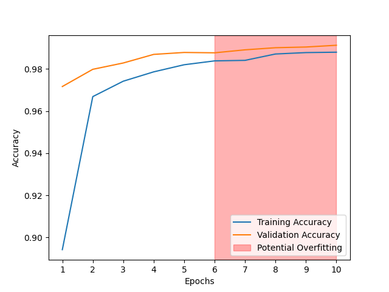

## Digits Classification with Neural Networks

This project primarily uses a Convolutional Neural Network to identify handwritten digits, trained on Tensorflow's MNIST dataset and additionally tested with original images.

The model has been converted to a web format with TensorflowJS and can be used here: [weblink]

### Architecture

A Fully Connected Network (without convolution layers) was built first for preparation and learning. The FCN consisted of a simple Sequential network with two hidden layers of 128 nodes each, followed by 10 output nodes. The output layer employed a softmax activation function, with each output node representing the prediction for a particular digit, for digits 0 through 9 via a value of 0 or 1.

A Convolutional Neural Network was built second for a more appropriate approach for feature extraction and identification from images. The Sequential network was built similarly to the FCN, however now involving two sets of a convolution layer followed by a pooling layer. 

### Training, Validation, and Testing

The MNIST dataset provided distinct datasets for labelled training and validation data. The FCN and CNN were trained on the designated training set, and evaluated on the validation set. Additionally, 10 original images depicting handwritten digits were created, and an interactive program was devloped for a user to enter the proper labels for each image as the NN assesses them (giving a final accuracy metric).

### Site

The CNN was converted to a web format and can be accessed here: [weblink]

Any user can draw their own "handwritten" digit and have the model predict which digit was entered.

### Conclusions

As a simple research task, the effects of training for successive epochs on the accuracy of the model were calculated and graphed:

A potential overfit region is marked, starting from when the Validation Accuracy decreases for the first time, following the previous epoch.
